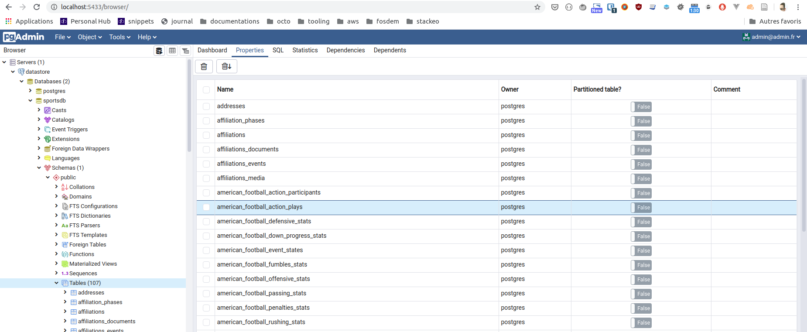

## Use graphql service to expose and manipulate data from a database

the goal of this spike is to validate a backend architecture based on GraphQL API and ORM for postgresql.

* python stack : ariadne + sqlalchemy
* typescript stack : apollo server + prisma

I have used [sportsdb](http://sportsdb.org/sd) as datasource to populate postgresql database.

## references

## step 1 : Run the datastore and import sql dumps

I have used the convention on `postgresql` docker image. We can put sql dump in `/docker-entrypoint-initdb.d` directory. The container will load
the image when it start first.

* https://hub.docker.com/_/postgres : see section `Initialization scripts`

## step 2 : Ensure the datastore can be running in github action

I have used `docker-compose` to package this spike environment.
*Github Action* can load docker-compose definition on the image `ubuntu`.

* take a look on [github action definition](.github/workflows/main.yml)

I develop a script to check the datastore is up and running on `Github Action` before moving next
step.

* take a look on [wait_datastory.py](ci_tests/ci_tests/wait)

## step 3 : Implement ORM stack with sqlalchemy and ariadne

There is an automatic mapping between the SQLAlchemy item, Ariadne and the schema.
I don't have to write api entity for every class. I just have to declare the query and mutation.
An automatic cast is done when we change the type from the database.

* see [query.py](sportsdb_backend_python/sportsdb_backend/api/query.py)

The `uvicorn server` is not resilient on query error. I have to investigate it. If the query is not done properly on the database, the server is not able to
respond to any other query. That's crap.

I have used `sqlacodegen` to build [entities](sportsdb_backend_python/sportsdb_backend/entities.py) from the database.
The result is ok, but I think the automapper approach is more interesting.

## step 4 : Implement ORM stack with Prisma and Apollo Server

